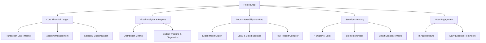

# Finloop: Core Features & Advertising Integration Report

This document provides a structured analysis of the features within the Finloop Expense Tracker application, followed by a comprehensive audit of the advertisement delivery system, including integration points, ad types, and technical configurations.

---

## 1. Structured Feature Directory

The Finloop ecosystem is built to provide users with local and synchronized personal finance management tools. Below is the categorized list of all functional modules currently implemented in the application.



### 1.1. Core Financial Ledger
*   **Transaction Log Timeline (`transactions_screen.dart`):**
    *   Chronological feed of financial entries categorized by tabs: **Daily**, **Weekly**, **Monthly**, and **Calendar** views.
    *   **Summary Banner:** Sticky header displaying running totals for *Income*, *Expenses*, and *Net Balance* corresponding to the selected period.
    *   **Scratchpad & Notes Tab:** A built-in scratchpad syncing notes directly to the ledger timeline for quick context preservation.
*   **Transaction Form System (`add_transaction_screen.dart`):**
    *   Create or edit three transaction types: **Income**, **Expense**, and **Transfer** (internal account shifts).
    *   Inputs: Date/Time picker, associated accounts, target categories, fee recording (for transfers), description, and custom notes.
    *   **Cloud Attachments:** Integrated attachment uploading, enabling users to bind image receipts or documents directly to transactions.
*   **Account Management (`manage_accounts_screen.dart`, `account_entries_screen.dart`):**
    *   Categorization of liquidity pools: **Cash Wallets**, **Bank Accounts**, and **Credit Cards**.
    *   **Detailed Account Ledgers:** Lists history specific to individual accounts, computing running balance progressions.
    *   **Credit Card Mechanics:** Set credit limits and view dynamic calculators for *Available Credit* vs. *Used Balance*.
*   **Category Customization (`manage_categories_screen.dart`, `add_category_screen.dart`):**
    *   Create income or expense categories.
    *   Visual customizations including custom colors and icon selections.

### 1.2. Visual Analytics & Reports (`charts_screen.dart`)
*   **Category Distribution:** Interactive pie/donut charts displaying spending concentrations.
*   **Budgeting & Analysis:** Monthly budget thresholds vs. actual expenses with threshold warning alerts.
*   **Dynamic Accent Adaptability:** Interface theme colors and analytics indicators adapt to theme palettes.

### 1.3. Data & Portability Services (`import_export_screen.dart`)
*   **Excel Export:** Generates formatted `.xlsx` sheets containing transactional records filtered by accounts and date boundaries.
*   **Excel Import:** Parses uploaded `.xlsx` files, automatically resolving and creating accounts and categories as needed.
*   **Backup & Restore:** Generates exportable backup bundles to preserve data when changing devices.
*   **PDF Compiler (`pdf_service.dart`):** Compiles and generates tabular PDF transaction reports for printing or accounting.

### 1.4. Security & Privacy System (`security_service.dart`, `passcode_lock_screen.dart`)
*   **PIN Protection:** 4-digit security PIN required before accessing data.
*   **Biometrics:** Optional integration with device hardware APIs (Fingerprint / Face ID).
*   **Smart Auto-Lock:** Monitors background timers and automatically locks the app when the configured idle period is exceeded.

### 1.5. User Engagement
*   **Local Notifications (`notification_service.dart`):** Daily reminders at a configured hour to log expenses.
*   **In-App Ratings (`app_review_service.dart`):** Non-intrusive rating dialog requests triggered after successfully saving transactions.

---

## 2. Advertisement Integration Report

The advertising framework is built on the **Google Mobile Ads SDK** for Flutter. Execution and lifecycle tracking are centralized via `AdService` (`lib/services/ad_service.dart`).

### 2.1. Global Settings & Controls
*   **Global Toggle:** `AdService.adsEnabled` (defaults to `true` but can be flipped to `false` for ad-free tiers).
*   **Development Testing:** Configured to serve Test Ads in debug builds (`kReleaseMode == false`) and Production Ads in release builds (`kReleaseMode == true`).
*   **Registered Test Devices:** Physical device ID `3AADB797CBEF6C8C20BFB19C192F2639` is hardcoded to receive test ads safely.

---

### 2.2. Ad Placements and Specifications

| Ad Type | Placement Location | Trigger Triggering Event | Integration Details / Fallbacks |
| :--- | :--- | :--- | :--- |
| **Banner Ad** (Adaptive) | Bottom of `TransactionsScreen` | Screen rendering | Uses `BannerAdWidget` with standard **Anchored Adaptive Banner** sizes to dynamically match screen width. Height is standard (50px). |
| **Interstitial Ad** | `TransactionsScreen` (FAB) | Saving a newly added transaction | Displays after the user saves a new transaction. Checks for rating prompt on dismissal. |
| **Interstitial Ad** | `TransactionTile` | Saving edits to an existing transaction | Displays after modifying a transaction from the main log. |
| **Interstitial Ad** | `AccountEntriesScreen` (FAB) | Saving a newly added account transaction | Displays after creating a pre-filled transaction inside account details. |
| **Interstitial Ad** | `AccountEntriesScreen` (Tile) | Saving edits to a transaction | Displays after saving edits to a transaction from the account history view. |
| **Rewarded Ad** | `TransactionsScreen` (Filters Panel) | Tapping the lock icon to unlock advanced search filters | Grants **24 hours** of advanced filtering capabilities (`filters_unlocked_until` in SharedPreferences). If the ad fails to load, access is granted automatically as a fallback. |
| **Rewarded Ad** | `ImportExportScreen` | Tapping "Export Excel" / "Export Backup" | Grants immediate permission to export data. If the ad fails, compilation starts automatically as a fallback. |
| **Rewarded Ad** | `TransactionsScreen` (PDF Export) | Tapping the "Export PDF" button | Grants immediate permission to compile the PDF ledger report. If the ad fails, PDF generation executes as a fallback. |

---

### 2.3. Ad Unit Configurations

```
                                  ┌── Banner Ad (Android Prod: ca-app-pub-9816661566128786/1079689083)
                                  │
┌── Google AdMob (Android IDs) ───┼── Interstitial Ad (Android Prod: ca-app-pub-9816661566128786/3753953881)
│                                 │
│                                 └── Rewarded Ad (Android Prod: ca-app-pub-9816661566128786/3791128275)
│
│                                 ┌── Banner Ad (iOS Prod/Test: ca-app-pub-3940256099942544/2934735716)
│                                 │
└── Google AdMob (iOS IDs) ───────┼── Interstitial Ad (iOS Prod/Test: ca-app-pub-3940256099942544/4411468910)
                                  │
                                  └── Rewarded Ad (iOS Prod/Test: ca-app-pub-3940256099942544/1712485313)
```

> [!NOTE]
> Android uses production-ready AdMob IDs. Since the iOS version is not yet live, the iOS configurations fallback to official Google AdMob test IDs to prevent loading failures and policy violations.

---

## 3. Technical Implementations & Security Alignments

### 3.1. Passcode Loop Bypass
A primary issue in mobile ad integration is app lifecycle tracking. When a full-screen Interstitial or Rewarded ad is displayed:
1. The app triggers background state `AppLifecycleState.paused` (Ad overlays the application).
2. Upon ad dismissal, the app triggers foreground state `AppLifecycleState.resumed`.

Under typical configurations, transitioning from background to foreground triggers the Passcode Lock Screen, which interrupts the user immediately after viewing the ad.

To prevent this lock loop, `main.dart` synchronizes with the `AdService.isAdShowing` state:
```dart
@override
void didChangeAppLifecycleState(AppLifecycleState state) async {
  final security = SecurityService();
  if (state == AppLifecycleState.paused) {
    if (AdService.isAdShowing) return; // Bypass background state recording
    await security.recordAppClosedTime();
  } else if (state == AppLifecycleState.resumed) {
    if (AdService.isAdShowing) return; // Bypass passcode check on return
    // ... normal passcode check logic
  }
}
```

### 3.2. Invalid Traffic Protection (Cooldown)
To comply with AdMob publisher policies and protect user experience, a cooldown period is enforced for Interstitial ads to prevent rapid, consecutive ad displays.
*   **Cooldown duration:** **3 minutes** (`AdService.interstitialCooldown`).
*   **Behavior:** If a transaction is modified and saved before the cooldown expires, the interstitial ad call is skipped, and the action callback runs immediately.

### 3.3. Ad Preloading & Cache Warm-Up
To eliminate latency when showing ads, the SDK loads interstitial and rewarded instances in the background:
*   On SDK initialization (`AdService.initialize()`), `preloadInterstitial()` and `preloadRewarded()` are triggered.
*   Upon displaying or failing to show an ad, the cache is immediately cleared, and a new ad instance is pre-cached.
